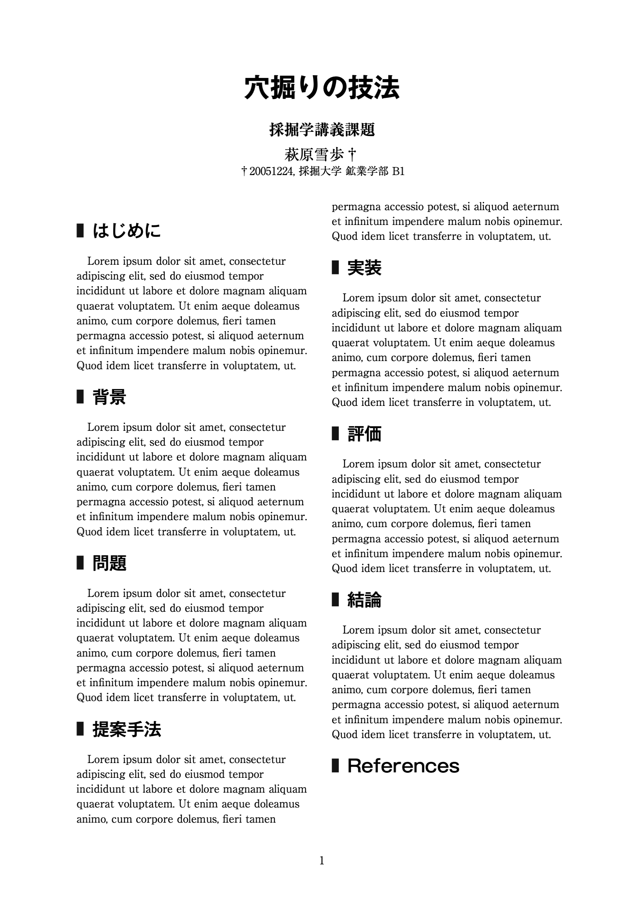

# Report Template



Typstによるレポート作成のためのテンプレートです．

This is a template for writing reports using Typst.

## Build

Makeを用いてビルドできます．

Can be built with `make`.

また，ファイル構成さえ理解していれば，直接Typstコマンドを実行してビルドすることも可能です．

it is also possible to build directly using the Typst command, provided you understand the file structure.

### Basic Build

```bash
make
```

### Build with Hot-reload

```bash
make watch
```

### Open PDF (macOS only)

```bash
make open
```

## How to Use

### A: Monolithic Report
`pages/paper.typ` にレポート本文を（そのまま）記述してください．

Edit `pages/paper.typ` to write the main content of your report.

### B: Modular Report

`pages/` フォルダ内に各章ごとのTypstファイルを作成し，`main.typ` でそれらをインポートして利用してください．

Create separate Typst files for each chapter in the `pages/` folder, and import them in `main.typ`.

#### Code Example
```typst
#include "/pages/introduction.typ"
#include "/pages/background.typ"
#include "/pages/problem.typ"
```

## License

[MIT License](https://choosealicense.com/licenses/mit/)

